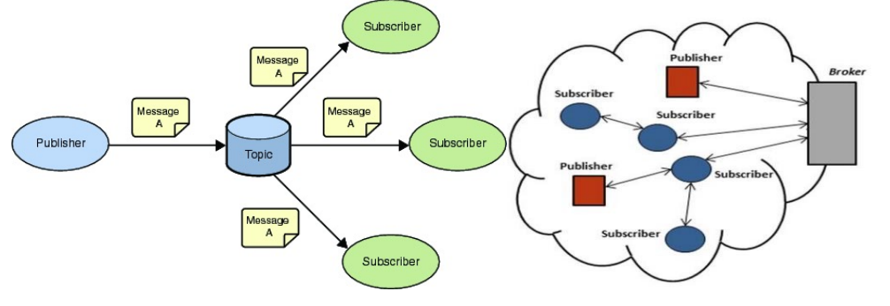

## Internet of things

### Example :

safer automotive, smart appliances, healthcare,
industrial internet, m2m ( machine to machine)

## Virtualization:

1.  Hosted architecture - install and runs as an application.

    - Relies on host os for physical resources management

2.  Bare-Metal(hypervisor) Architecture - Lean virtualization centric kernel.

    - Service Console for agents and helper applications

### Separatioon of responsibilities:

1. On-premise ( you handle everything)
2. IaaS - Infrastructure as Service ( OS + DB + App)

   - Example : Amazon ec2

3. PaaS - Platform as Service (App)

   - Example : Ms Azure, VMForce.com

4. SaaS - Software as Service (they manages all)

   - Example : Google Apps

## Containers vs VMs

### VM

Within each virtual machine runs a unique guest operating system.Each VM has its own binaries, libraries, and applications that it services

### Containers

Containers sit on top of a physical server and its host OS. They are isolated but share OS, bins/libraries

## IoT Cloud Service Architecture

1. End-level user

- 1.1. Consumer IoT

  - Home, lifestyle, health

- 1.2. Business IoT
  - Retail, healthcare, energy, services etc
- `Security : Security architecture planning`

2. System level

- 2.1. Presentation/Visualization ( TDI, MDI, Midi, ASCII, MPEG etc)
- 2.2.Processing
- 2.3. Database (Hadoop, HBase, Cassandra, MongoDB)
- 2.4. Middleware ( RabbitMQ, Flume, Kafka, Storm)
- `Security : Access Control, Device authentication`

3. Communication level

- 3.1. Session protocols (MQTT, CoAP, DDS, XMPP, AMQP,HTTP,FTP,SSH)
- 3.2. Network/Transport protocols (IPv4, IPv6, 6LoWPAN,RPL)
- 3.3. Data link protocols:
  - Short Range: RFID,Bluetooth, BluetoothLE
  - Long-range cellar: GSM (2G), CDMA (3G), LTE (4G)
  - Long-range non-cellular: WiFi,ANT/ANT+, Zigbnee, Z-Wave, RF Mash
  - Thethered:Ethernet, UBP, MBus
- `Security : Firewall/IPS, updates/patching`

4. Physical level

- 4.1. Devices : Smart Meters, Smart lightbulb, RFID tags drones, wearables, etc
  - `Security: Surveillance`
- 4.2. Device Components :
  - Sensors (temperature, pressure etc)
  - Actuators (hydraulic, electric etc )
  - Communication hardware (wireless, usb,OBD2)
  - Processor (Controller, OS)
  - Other Hardware (transistors, PCB, batteries)
  - `Security: Incident Management, Secure booting`

## Internet of things

1.  Applications :

- Smart Cities
- Distributed Computing in IoT Cloud/ Silos
- Semantic Sensor Network
- Heath Care App

2. IoT Sensor and Actuators :

- 2.1. Sensors & Actuators
  - Sensors: Temperature, humidity, Motion
  - Actuators: Engines, Plugs
- 2.2.Embedded Devices - Smart Objects
  - Embedded IoT GWs and Nodes (PoC: Raspberry PI,
    Arduino)
  - Smart Objects API & Device Models
  - Gateway Services
- 2.3. IoT Middleware (M2M/ Internet Protocols)
  - REST & WS-SOA, WEB 2.0 and WEB 3.0
  - CoAP
  - MQTT
- 2.4. IoT Cloud / Back-end Systems
  - AWS, AZURE, Oracle IoT
  - Open Source Clouds

## IoT Communication Protocols

1. Infrastructure
   - Ipv4/IPv6, ZigBee, GSM (3G/4G/5G)
2. Identification
   - uCode, IPv6, URIs
3. Comms/ Transport
   - Wi-Fi, Bluetooth, BLE, GSM (3G/4G)
4. Discovery
   - mDNS, DNS-SD
5. Data Protocols
   - MQTT, CoAP/HTTP-REST, AMQP, Websocket
6. Device Management
   - TR-069, OMA-DM
7. Semantic
   - JSON-LD
8. Multi-layer Frameworks
   - Amazon Alexa, Google Home, Apple HomeKit
9. Security - Transversal
   - Global Platform, Open Trust protocol in TEE, X509, ASN.1 DER vs COSE/CBOR

## REST

### Representational State Transfer

Relies on a stateless, client-server, cacheable communication protocol
Instead of using complex mechanisms to connect between machines, simple HTTP
is used to make call between machine.

Representation = JSON or XML

    REST is not a protocol nor a standard, but an ARCHITECTURAL STYLE

Thus, REST uses HTTP for all four CRUD (Create/Read/Update/Delete)
operations

### REST over HTTP – Uniform interface

1. CRUD -operations
   - Create
     - Insert (SQL)
     - PUT/POST (HTTP)
   - Read
     - Select(SQL)
     - Get (HTTP)
   - Update
     - Update (SQL)
     - PUT/ PATCH (HTTP)
   - Delete
     - Delete (SQL & HTTP)

## CoAP

    COnstrained Application Protocol
        Default: UDP Port 5683

1. Properties and Features:

   - Document-Centric.
   - UDP binding, with optional reliability supporting unicast and multicast request (5683 UDP Port)
   - Asynchronous Messages Exchanges
   - Low Header Overhead and Parsing Complexity(4-byte Header)
   - Simple proxying and Caching Capabilities
   - Security binding to DTLS based PSK,RPK and Certificate Security
   - A CoAP implementation acts both in client and server role
   - Open IETF Standard
   - UDP, SMS, TCP Support
   - Built-in Discovery
   - A very efficient RESTful protocol
   - Ideal for constrained devices and networks
   - Specialized for M2M applications
   - Easy to proxy to/from HTTP
   - Embedded web transfer protocol (coap:// )
   - Supports GET,POST,PUT,DELETE methods
   - Caching- CoAP supports caching of responses to efficiently fulfill requests

2. Transaction Model:
   - 1.Transport
     - CoAP currently defines:
       - UDP binding with DTLS security
       - CoAP over SMS or TCP possible
   - 2.Base Messaging
     - Simple message exchange between endpoints
     - Confirmable or Non-Confirmable Message answered by Acknoledgement or Reset message
3. Messaging Model

   - Confirmable (CON)
     - Default Timeout and Exponential Backoff with some Message ID
       Client -> CON -> Server
       Client <- ACK <- Server
   - Non-Confirmable (NON)
     - Simple data, message ID for duplicate detection
       Client -> CON -> Server

4. Implementations
   - C:
     - libCoAP
     - OpenCoAP
     - C CoAP Library Erbium
   - Java:
     - CoAP Library Californium / org.ws4d.coap (ws4d-jcoap.jar)
     - jCoAP
   - mbed includes CoAP support
   - TinyOS and Contiki include CoAP support
   - Firefox has a CoAP plugin called Copper

## MQTT

    Message Queueing Telemetry Transport – MQTT –
    Default TCP Port 1883

1. Properties and Features:
   - Publish / Subscribe message pattern -> one-to-many messaging distribution,applications decoupling;
   - Message transport payload-agnostic;
   - Assumes the use of the TCP/IP protocol stack;
   - 3 QoS Levels: At Most Once (0), At Least Once (1), Exactly Once (2);
   - Small Transport Overhead, minimal messages exchanges
   - Will Mechanism, to indicate to the other part an abnormal disconnection

### Publish Subscribe Messaging aka One to Many

A Publish Subscribe messaging protocol allowing a message to be published once and multiple consumers (applications / devices) to receive the message providing decoupling between the producer and consumer(s).
A producer sends (publishes) a message (publication) on a topic (subject).
A consumer subscribes (makes a subscription) for messages on a topic (subject)
A topic is managed within a MQTT Broker

