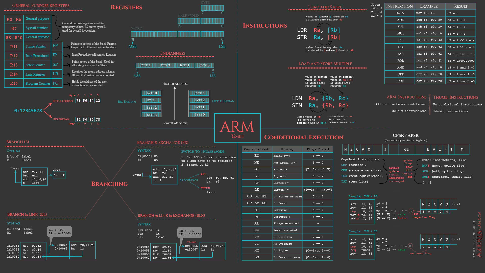

## Internet of things

### Example :

safer automotive, smart appliances, healthcare,
industrial internet, m2m ( machine to machine)

## Virtualization:

1.  Hosted architecture - install and runs as an application.

    - Relies on host os for physical resources management

2.  Bare-Metal(hypervisor) Architecture - Lean virtualization centric kernel.

    - Service Console for agents and helper applications

### Separatioon of responsibilities:

1. On-premise ( you handle everything)
2. IaaS - Infrastructure as Service ( OS + DB + App)

   - Example : Amazon ec2

3. PaaS - Platform as Service (App)

   - Example : Ms Azure, VMForce.com

4. SaaS - Software as Service (they manages all)

   - Example : Google Apps

## Containers vs VMs

### VM

Within each virtual machine runs a unique guest operating system.Each VM has its own binaries, libraries, and applications that it services

### Containers

Containers sit on top of a physical server and its host OS. They are isolated but share OS, bins/libraries

## IoT Cloud Service Architecture

1. End-level user

- 1.1. Consumer IoT

  - Home, lifestyle, health

- 1.2. Business IoT
  - Retail, healthcare, energy, services etc
- `Security : Security architecture planning`

2. System level

- 2.1. Presentation/Visualization ( TDI, MDI, Midi, ASCII, MPEG etc)
- 2.2.Processing
- 2.3. Database (Hadoop, HBase, Cassandra, MongoDB)
- 2.4. Middleware ( RabbitMQ, Flume, Kafka, Storm)
- `Security : Access Control, Device authentication`

3. Communication level

- 3.1. Session protocols (MQTT, CoAP, DDS, XMPP, AMQP,HTTP,FTP,SSH)
- 3.2. Network/Transport protocols (IPv4, IPv6, 6LoWPAN,RPL)
- 3.3. Data link protocols:
  - Short Range: RFID,Bluetooth, BluetoothLE
  - Long-range cellar: GSM (2G), CDMA (3G), LTE (4G)
  - Long-range non-cellular: WiFi,ANT/ANT+, Zigbnee, Z-Wave, RF Mash
  - Thethered:Ethernet, UBP, MBus
- `Security : Firewall/IPS, updates/patching`

4. Physical level

- 4.1. Devices : Smart Meters, Smart lightbulb, RFID tags drones, wearables, etc
  - `Security: Surveillance`
- 4.2. Device Components :
  - Sensors (temperature, pressure etc)
  - Actuators (hydraulic, electric etc )
  - Communication hardware (wireless, usb,OBD2)
  - Processor (Controller, OS)
  - Other Hardware (transistors, PCB, batteries)
  - `Security: Incident Management, Secure booting`

## Internet of things

1.  Applications :

- Smart Cities
- Distributed Computing in IoT Cloud/ Silos
- Semantic Sensor Network
- Heath Care App

2. IoT Sensor and Actuators :

- 2.1. Sensors & Actuators
  - Sensors: Temperature, humidity, Motion
  - Actuators: Engines, Plugs
- 2.2.Embedded Devices - Smart Objects
  - Embedded IoT GWs and Nodes (PoC: Raspberry PI,
    Arduino)
  - Smart Objects API & Device Models
  - Gateway Services
- 2.3. IoT Middleware (M2M/ Internet Protocols)
  - REST & WS-SOA, WEB 2.0 and WEB 3.0
  - CoAP
  - MQTT
- 2.4. IoT Cloud / Back-end Systems
  - AWS, AZURE, Oracle IoT
  - Open Source Clouds

## IoT Communication Protocols

1. Infrastructure
   - Ipv4/IPv6, ZigBee, GSM (3G/4G/5G)
2. Identification
   - uCode, IPv6, URIs
3. Comms/ Transport
   - Wi-Fi, Bluetooth, BLE, GSM (3G/4G)
4. Discovery
   - mDNS, DNS-SD
5. Data Protocols
   - MQTT, CoAP/HTTP-REST, AMQP, Websocket
6. Device Management
   - TR-069, OMA-DM
7. Semantic
   - JSON-LD
8. Multi-layer Frameworks
   - Amazon Alexa, Google Home, Apple HomeKit
9. Security - Transversal
   - Global Platform, Open Trust protocol in TEE, X509, ASN.1 DER vs COSE/CBOR

## REST

### Representational State Transfer

Relies on a stateless, client-server, cacheable communication protocol
Instead of using complex mechanisms to connect between machines, simple HTTP
is used to make call between machine.

Representation = JSON or XML

    REST is not a protocol nor a standard, but an ARCHITECTURAL STYLE

Thus, REST uses HTTP for all four CRUD (Create/Read/Update/Delete)
operations

### REST over HTTP – Uniform interface

1. CRUD -operations
   - Create
     - Insert (SQL)
     - PUT/POST (HTTP)
   - Read
     - Select(SQL)
     - Get (HTTP)
   - Update
     - Update (SQL)
     - PUT/ PATCH (HTTP)
   - Delete
     - Delete (SQL & HTTP)

## CoAP

    COnstrained Application Protocol
        Default: UDP Port 5683

1. Properties and Features:

   - Document-Centric.
   - UDP binding, with optional reliability supporting unicast and multicast request (5683 UDP Port)
   - Asynchronous Messages Exchanges
   - Low Header Overhead and Parsing Complexity(4-byte Header)
   - Simple proxying and Caching Capabilities
   - Security binding to DTLS based PSK,RPK and Certificate Security
   - A CoAP implementation acts both in client and server role
   - Open IETF Standard
   - UDP, SMS, TCP Support
   - Built-in Discovery
   - A very efficient RESTful protocol
   - Ideal for constrained devices and networks
   - Specialized for M2M applications
   - Easy to proxy to/from HTTP
   - Embedded web transfer protocol (coap:// )
   - Supports GET,POST,PUT,DELETE methods
   - Caching- CoAP supports caching of responses to efficiently fulfill requests

2. Transaction Model:
   - 1.Transport
     - CoAP currently defines:
       - UDP binding with DTLS security
       - CoAP over SMS or TCP possible
   - 2.Base Messaging
     - Simple message exchange between endpoints
     - Confirmable or Non-Confirmable Message answered by Acknoledgement or Reset message
3. Messaging Model

   - Confirmable (CON)
     - Default Timeout and Exponential Backoff with some Message ID
       Client -> CON -> Server
       Client <- ACK <- Server
   - Non-Confirmable (NON)
     - Simple data, message ID for duplicate detection
       Client -> CON -> Server

4. Implementations
   - C:
     - libCoAP
     - OpenCoAP
     - C CoAP Library Erbium
   - Java:
     - CoAP Library Californium / org.ws4d.coap (ws4d-jcoap.jar)
     - jCoAP
   - mbed includes CoAP support
   - TinyOS and Contiki include CoAP support
   - Firefox has a CoAP plugin called Copper

## MQTT

    Message Queueing Telemetry Transport – MQTT –
    Default TCP Port 1883

### Definition

MQTT is a lightweight message queueing and transport protocol.
MQTT, as its name implies, is suited for the transport of telemetry data (sensor and actor data)
MQTT is very lightweight and thus suited for

- M2M (Machine to Machine / Mobile to Mobile)
- WSN (Wireless Sensor Networks)
- IoT (Internet of Things)
  where sensor and actor nodes communicate with applications through the MQTT message broker

### History

MQTT was developed by IBM and Eurotech.
Eventually, MQTT version 3.1 is to be adopted and published as an official standard by
OASIS (process ongoing).
As such, OASIS becomes the new home for the development of MQTT.

1. Properties and Features:

   - Publish / Subscribe message pattern -> one-to-many messaging distribution, applications decoupling;
   - Publish / Subscribe (PubSub) model
   - Decoupling of data producer (publisher) and data consumer (subscriber) through topics
     (message queues)
   - Message transport payload-agnostic;
   - Assumes the use of the TCP/IP protocol stack;
   - 3 QoS Levels: At Most Once (0) (best effort), At Least Once (1), Exactly Once (2);
   - Small Transport Overhead, minimal messages exchanges
   - Will Mechanism, to indicate to the other part an abnormal disconnection
   - Lightweight message queueing and transport protocol
   - Asynchronous communication model with messages (events)
   - Low overhead (2 bytes header) for low network bandwidth applications
   - Simple protocol, aimed at low complexity, low power and low footprint implementations (e.g.
     WSN - Wireless Sensor Networks)
   - Runs on connection-oriented transport (TCP). To be used in conjunction with 6LoWPAN
     (TCP header compression)

### Publish Subscribe Messaging aka One to Many

A Publish Subscribe messaging protocol allowing a message to be published once and multiple consumers (applications / devices) to receive the message providing decoupling between the producer and consumer(s).
A producer sends (publishes) a message (publication) on a topic (subject).
A consumer subscribes (makes a subscription) for messages on a topic (subject)
A topic is managed within a MQTT Broker

### MQTT model

The core elements of MQTT are

- clients
- servers (=brokers)
- sessions
- subscriptions
- topics.
  

1. MQTT client (=publisher, subscriber):

- Clients subscribe to topics to publish and receive messages.
- Thus subscriber and publisher are special roles of a client.

  

2. MQTT server (=broker):

- Servers run topics, i.e. receive subscriptions from clients on topics, receive messages from
  clients and forward these, based on client’s subscriptions, to interested clients.

3. Topic:

- Technically, topics are message queues.
- support the publish/subscribe pattern for clients.
- allow clients to exchange information with defined semantics.
  - Example topic: Temperature sensor data of a building.

4. Session

- A session identifies a (possibly temporary) attachment of a client to a server. All
  communication between client and server takes place as part of a session.

5. Subscription

- subscription logically attaches a client to a topic.
  When subscribed to a topic, a client can exchange messages with a topic.
- Subscriptions can be
  - «transient» or
  - «durable»,
    depending on the clean session flag in the CONNECT message:

6. Message

- Messages are the units of data exchange between topic clients
- MQTT is agnostic to the internal structure of messages
  

### MQTT message format

MQTT messages contain a mandatory fixed-length header (2 bytes) and an optional message specific variable length header and message payload

#### Message Type

1. CONNECT
   
2. CONNACK
   
3. PUBLISH
   - RETAIN=1 in a PUBLISH message instructs the server to keep the message for this topic.
   - When a new client subscribes to the topic, the server sends the retained message.
     
4. PUBACK
   
5. PUBREC
   
6. PUBREL
   
7. PUBCOMP
   
8. SUBSCRIBE
   
9. SUBACK
   
10. UNSUBSCRIBE
    
11. UNSUBACK
    
12. PINGREQ
    
13. PINGRESP
    
14. DISCONNECT
    

#### QoS (Quality of Service)

MQTT provides the typical delivery quality of service (QoS) levels of message oriented middleware
Even though TCP/IP provides guaranteed data delivery, data loss can still occur if a TCP connection breaks down and messages in transit are lost.
Therefore MQTT adds 3 quality of service levels on top of TCP:

1. QoS level 0

   - At-most-once delivery («best effort»)
   - Messages are delivered according to the delivery guarantees of the underlying network (TCP/IP)
   - Example : Temperature sensor data which is regularly published
     

2. QoS level 1
   - At-lest-once delivery.
   - Messages are guaranteed to arrive, but there may be duplicates.
   - Example : A door sensor senses the door state. It is important that door state changes are published losslessly to subscribers (e.g. alarming function). Applications simply discard duplicate messages by evaluating the message ID field.
     
3. QoS level 2
   - Exactly-once delivery.
   - This is the highest level that also incurs most overhead in terms of control messages and the need for locally storing the messages.
   - Exactly-once is a combination of at-least-once and at-most-once delivery guarantee.
   - Example: Applications where duplicate events could lead to incorrect actions, e.g. sounding an alarm as a reaction to an event received by a message.
     

### MQTT-SN

- MQTT-SN is an extension of MQTT for WSNs.
- WSNs (Wireless Sensor Networks) usually do not have TCP/IP as transport layer.
- They have their own protocol stack such as ZigBee on top of IEEE 802.15.4 MAC layer. Thus, MQTT which is based on TCP/IP cannot be directly run on WSNs.
- WSNs are connected to traditional TCP/IP networks through gateway devices
- MQTT-SN is aimed at constrained low-end devices, usually running on a batttery, such as ZigBee devices

MQTT-SN is a largely based on MQTT, but implements some important optimizations for wireless networks:

- Topic string replaced by a topic ID (fewer bytes necessary)
- Predefined topic IDs that do not require a registration
- Discovery procedure for clients to find brokers (no need to statically configure broker addresses)
- Persistent will message (in addition to persistent subscriptions)
- Off-line keepalive supporting sleeping clients (will receive buffered messages from the server once they wake up)

2. MQTT Implementations
   - Client
     - WebSphere MQ Telemetry Client (C,Java)
     - Eclipse Paho (C, Java, Python, Lua)
   - Server
     - WebSphere MQ Broker (C, Java)
     - Really Small Message Broker, RSMB (C)
     - Mosquitto (JMS)
     - EMQX

## MQTT vs CoAP

### MQTT

- Many-to-Many Communication Protocol
- Decoupling producers and consumers
- Data - Centric.
- It does best as a communication bus for live data
- Clients makes long-lived outgoing TCP connection to a broker
- No problem behind NAT
- No support for labelling messages. All clients must know the message format up-front to allow the communication.
- 3 QoS Levels

### MQTT

- One-to-One Communication Protocol (for UDP there is multicast)
- Transferring State Information between client and server
- Document - Centric
- Best-suited to a state transfer model, not purely event-based
- Clients and servers both send and receive UDP packets.
- Tunnelling or Port Forwarding can be used to allow CoAP in NAT
  environments (IPv4). With IPv6 no problems.
- Provides inbuilt support for content negotiation (ACCEPT) and
  discovery (list), allowing devices to find a way of exchanging data.
- Provides inbuilt support for content negotiation (ACCEPT) and
  discovery (list), allowing devices to find a way of exchanging data.

## IoT Communications Protocols weaknesses

MQTT, CoAP, DDS and XMPP are the main competitors for IoT messaging at the ApplicationLayer
Each one of these has however some weaknesses:

- MQTT appears weak in security;
- DDS has problems in terms of scalability and various version dependence;
- XMPP is excessively heavy;
- CoAP not suitable for sending large sums of data and not reliable

## Some acronyms related IoT Gateway Programming: Java Device Input Output (DIO)

#### UART - Universal Asynchronous Receiver/Transmitter

- UARTs are commonly used in conjunction with communication standards such as TIA (formerly EIA) RS-232, RS-422 or RS-485
- It is an asynchronous protocol because of the protocol and the 4 wires:
  - 2 wires for Data: RX (Receive) and TX (Transmit)
  - 2 wires for VCC (Voltage) and GND (Ground)

#### GPIO - General Purpose Input Output

- Logical 1 or 0 controlled by software
- Two wires (one for data, one for ground)
- Dedicated to a single purpose
- Drive a single LED
- Statusflag
- “bit-banging”

#### SPI - Serial Peripheral Interface

- Single master/multiple slaves connected to a single bus
- Serial, full-duplex
- Bits shift in on MISO (Master In Slave Out) as they shift out on MOSI (Master Out Slave In)

#### I2C - Inter-Integrated Circuit

- Multi-master/multi-slave bus
  - Device I/O supports only slave devices
  - One master is assumed
- Serial, half-duplex because of the protocol and 4 or 5 wires:
  - 2 wires (SLC – I2C Clock, SDA – I2C Data)
  - 2 wires for VCC (Voltage) and GND (Ground)
  - 1 optional – RESET wire
- One line for data, one for clock, no separate address lines

## OS Security

### Kernel

- the first "program" loaded by the BIOS/boot loader
- its functionality (the way it works) is very closely related to the CPU architecture
- represents the "glue layer" which provides the environment necessary for the applications to run on the given hardware
- responsible for the management (initialisation, utilisation << incl. protection >>, deallocation) of all computer resources (examples of resources: CPU, memory, storage devices, etc.)
- responsible for the management of all processes

There are two main types of kernel architectures:

- monolithic – all the parts of the kernel execute in the same (kernel) address space
  - its capability is extensible through modules (drivers). Once these modules (drivers) are loaded, they become part of the running kernel (they run in the kernel address space).
  - advantages: speed
  - disadvantages: stability and security
- microkernel – only a few essential parts of the kernel execute in the kernel address space, the rest are running in user space as programs called “servers”
  - the communication between different parts of the kernel happens through IPC (Inter-Process Communication) mechanisms
  - advantages: stability, maintainability and security
  - disadvantages: speed, ease of implementation

### Driver(s)

- part of the kernel, mainly responsible for the management of hardware
- contains device specific code
- communicates with the device through IRQs, I/O ports and DMA channels.
- main source of system instability

### System calls

- kernel code which permits user-space applications to use kernel-space functions/services in a legitimate way
- examples: file read/write, memory allocation, etc.
- it generally interfaces with applications through system libraries
- some of them are “intercepted” by antivirus software so it (the antivirus) is able to perform “on-access” scanning

### Applications

- programs that run outside the kernel and directly or indirectly provide services to the user (be it an administrator, end-user, hacker)
- when running, their entire “life” is strictly managed by the kernel
- examples: IoT Clients SW, IoT GW SW, HTTP server, shell, IM client, most viruses, etc.

## Linux OS security levels

1. The boot process

- represents the process of loading the kernel into memory
  and passing control to it
- for Linux on the IBM PC/IA 32 architecture, it can be
  broken into six logical stages:

  1.  BIOS selects the boot device
  2.  BIOS loads the bootsector/bootloader from the boot device
  3.  Bootsector/bootloader loads setup, decompression routines and compressed kernel image
  4.  The kernel is uncompressed in protected mode
  5.  Low-level initialisation (asm code)
  6.  High-level initialisation (C code)

- security considerations:
  - boot viruses (ancient)
  - boot device override
  - OS override
  - kernel parameters override

2. The kernel
   `command: $ dmesg | less`

- security considerations:
  - due to the key role of the kernel, security compromises at this level have the greatest impact and are the hardest to detect (although rare and somewhat harder to exploit)
  - examples of security vulnerabilities: buggy kernel code, bad drivers, kernel architecture (modules rootkits

3. Processes & memory
   `command: $ ps -e -o pid,ppid,uid,gid,ni,stat,time,%cpu,%mem,command | less`

- Process = program instance loaded in memory and running with its own dedicated address space and state information
- main characteristics:
  - PID = Process ID
  - PPID = Parent Process ID
  - UID = User ID of the process
  - GID = Group ID of the process
  - NI = process' NIce value
  - STAT = process STATe
  - TIME = cumulative CPU TIME used by this process
  - %CPU = CPU time used / the time this process has been running
  - %MEM = % of memory used by this process
  - COMMAND = the command line used to start the process
- process execution control – signals
  - Signal = a limited form of interprocess communication used to (asynchronously) notify a specific process that an event had occurred
  - exceptions – examples: division by zero, segmentation violation
  - kill system call – used between different processes
  - kernel

4. User system
5. The filesystem
6. Networking
7. General (DAC vs MAC)

To be continued

## ARM Assembly 32 bit

https://azeria-labs.com/writing-arm-assembly-part-1/

